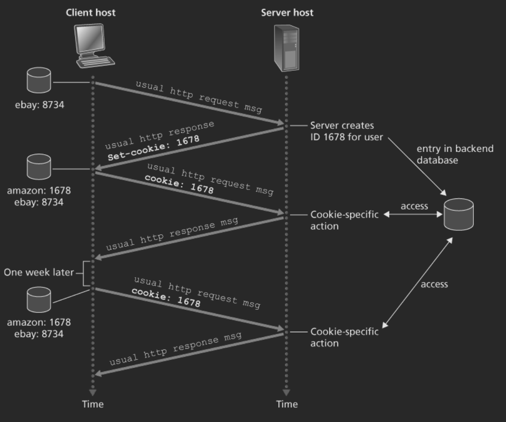
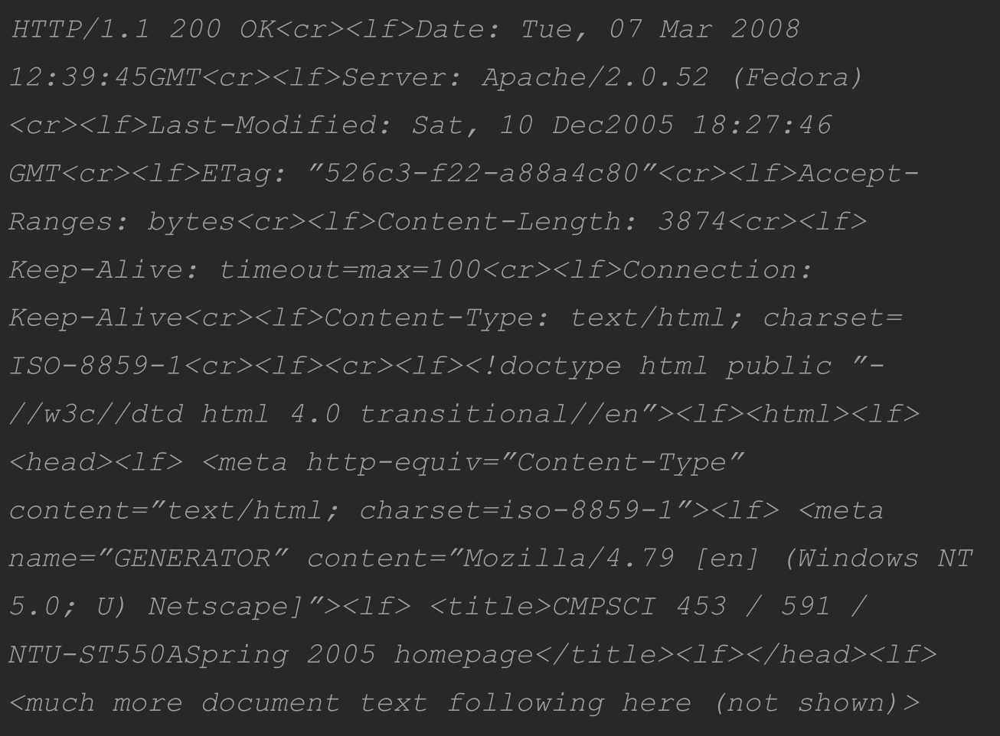
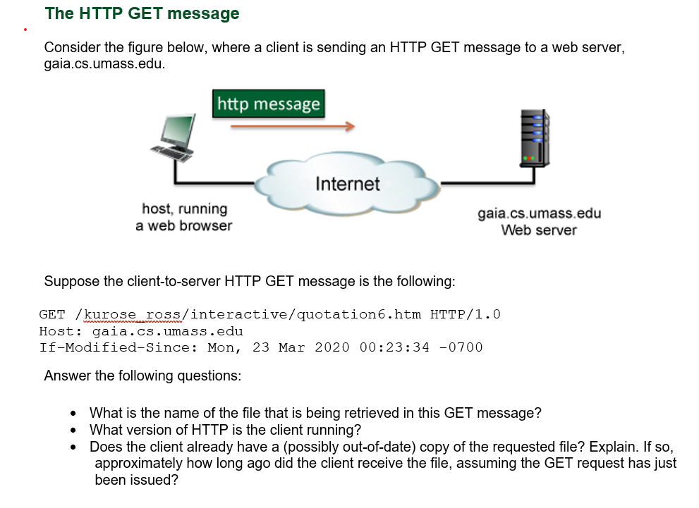

# Exercise Session 10
## Review questions
### E1 - R3
**Question:** For a communication session between a pair of processes, which process is the client and which eis the server?.

**Answer:** The client is the proces which initiates the communication while the server is the proces that responds.

### E2 - R12
**Question:** Consider an e-commerce site that wants to keep a purchase record for each of site customers. Describe how this can be done with cookies.

**Answer:** The client sends a request to the server like normal. In the response the server there is a identification number, which the client can then send to the server with every new request, thus the server knows who that person is.

### E3 - R20
**Question:** Look over your received e-mails, and examine the header of a message sent from a user with a .edu e-mail address. Is it possible to determine from the header the IP address of the host from which the message was sent? Do the same for a message sent from a Gmail account.

**Answer:** You can determine the IP address if you lok it up.

## Problem questions
### E1 - P5
**Question:** The text below shows the reply sent from the server in response to the HTTP GET message in the question above. Answer the following questions, indicating where in the message below you find the answer.

**A:** Was the server able to succesfully find th edocument or not? What time was the document reply provided?

**Answer:** On line 1 we can see both of these. The status code is 200, thus the server was able to find the html file. The reply was provided on Tue, 07 Mar 2008.

**B:** When was the document last modified?

**Answer:** We can see on line 3. That it was last modified on Sat, 10 Dec 2008 18:27:46

**C:** How many bytes are there in the document being returned?

**Answer:** We can see on line 5 that the content length is 3874 which should be bytes.

**D:** What are the first 5 bytes of the document being returned? Did the server agree to a persistent connection?

**Answer:** A double newline indicates that the body is coming up. Thus assuming UTF-8 encoding `<!doc`. I think it agreed to a persistent connection on line 6 and 7, but it has a timeout of 100, whic his probably in seconds.

### E2 - P10
**Question:** Consider a short, 10-meter link, over which a sender can transmit at a rate of $150 bits/sec$ in both directions. Suppose that packets containing data are $100,000 bits$ long, and packets containing only control (e.g., ACK or handshaking) are $200 bits$ long. Assume that $N$ parallel connections each get $1/N$ of the link bandwidth. Now consider the HTTP protocol, and suppose the each downloaded object is $100 Kbits$ long, and that the initial downloaded object contains $10$ referenced objects from the same sender. Would parallel downloads via parallel instances of non-presistent HTTP make sense in this case? Now consider persistent HTTP. Do you expect significant gains over the non-persistent case? Justify and explain you answer.

**Answer:** Due to the packets link transmission rate being so low. Using a persistent connection will not change much in terms of how fast we can transmit the data. Especially since the objects will in total be $1Mbit$ while the ACK's will only by $2kbit$. Using a persistent connection will give the server less overhead, but for the client it will not matter.

### E3
Assume that the current time at the client below is `Mon, 23 Mar 2020 00:53:34 - 0700`

- The file is named `quotation6.htm`
- The version is 1.0
- The client already has a version of the file which is 30 minutes old.

### E4
[DNS and HTTP delays quiz](http://gaia.cs.umass.edu/kurose_ross/interactive/DNS_HTTP_delay.php)

### E5 - P22
Consider distributing a file of $F=15Gbit$ to $N$ peers. The server has an upload rate of $u_s=30Mb/s$, and each peer has a download rate of $d_l=2Mb/s$ and an upload rate of $u$. For $N=10$, $100$ and $1000$ ond $u=300kb/s$, $700kb/s$ and $2Mb/s$, prepare a chart giving the minimum distribution time for each of the combinations of $N$ and $u$ for both client-server distribution and P2P distribution.

The lower bound for the minimum distribution time for client server is $D_{cs} \geq max(\frac{NF}{u_s}, \frac{F}{d_{min}})$, with this a table can be made.

|Peers|Lower bound|
|-----|-----------|
|10   |$\frac{10 \cdot 15Gbit}{30Mb/s}$|
|100  |$\frac{100 \cdot 15Gbit}{30Mb/s}$|
|1000 |$\frac{1000 \cdot 15Gbit}{30Mb/s}$|

For a P2P distribution we have that the lower bound is giving by $D_{P2P} \geq max(\frac{F}{u_s}, \frac{F}{d_{min}}, \frac{NF}{u_s + \sum_iu_i})$

This table is generated from a haskell function so the which might be wrong. The lower bound is most likely in seconds.

|Peers|Upload rate (kbits)|Lower Bound|
|-----|-------------------|-----------|
|10   | 300               | 7500      |
|100  | 300               | 25000     |
|1000 | 300               | 45454     |
|10   | 700               | 7500      |
|100  | 700               | 15000     |
|1000 | 700               | 20547     |
|10   | 2000              | 7500      |
|100  | 2000              | 7500      |
|1000 | 2000              | 7500      |
