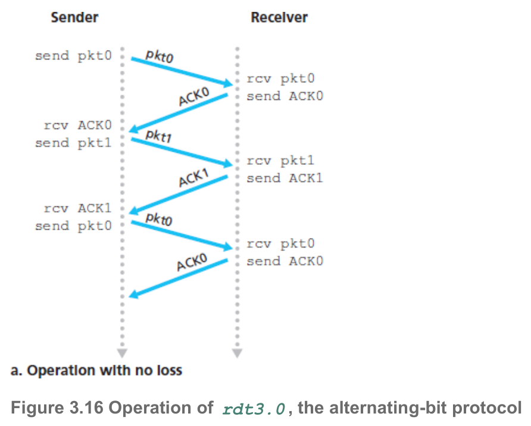
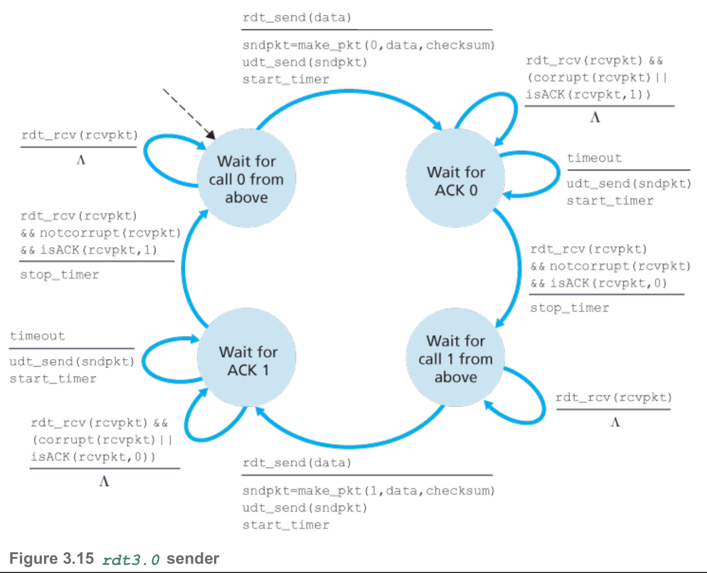
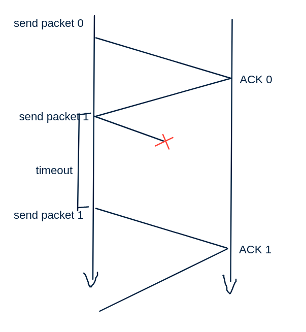
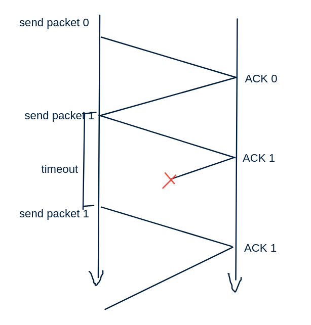
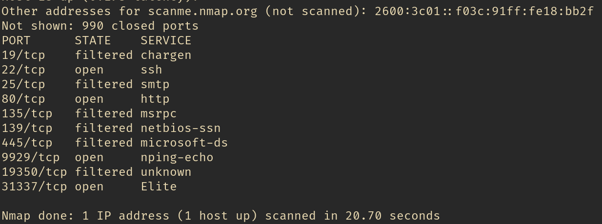

# Exercise Session 11
## Q1 - R3
Consider a TCP connection between Host A and Host B. Suppose that the TCP segments traveling from Host A to Host B have source port number x and destination port number y. What are the source and destination port numbers for the segments traveling from Host B to Host A?

They are reversed.

## Q2 - R7
Suppose a process in Host C has a UDP socket with port number 6789. Suppose both Host A and Host B each send a UDP segment to Host C with destination port number 6789. Will both of these segments be directed to the same socket at Host C? If so, how will the process at Host C know that these two segments originated from two different hosts?

I think they will end up on the same port as UDP is connectionless? They can be differentiated if the source port numbers are different, but i do not think that this is a good idea in general.

## Q3 - R12
Visit the Go-Back-N Java applet at the companion Web site. [Link](https://media.pearsoncmg.com/aw/ecs_kurose_compnetwork_7/cw/content/interactiveanimations/go-back-n-protocol/index.html)

1.  Have the source send five packets, and then pause the animation before any of the five packets reach the destination. Then kill the first packet and resume the animation. Describe what happens.

    As the first packet never arrives the receiver can not move will never send an ack for it or any other packets for that matter, as this apparently a special case. Eventually the timer for packet 0 runs out and packet 0-4 are retransmitted.

2.  Repeat the experiment, but now let the first packet reach the destination and kill the first acknowledgment. Describe again what happens.

    No retransmissions are needed since ACKs are cumulative meaning an ACK for packet 2 is also an ACK for packet 1 and 0.

3.  Finally, try sending six packets. What happens?

    As the window size is 5 we can not send the sixth pacet before packet zero has been acknowledged.

## Q4 - R13
Repeat R12, but now with the Selective Repeat Java applet. How are Selective Repeat and Go-Back-N different? [ Link ]( https://media.pearsoncmg.com/aw/ecs_kurose_compnetwork_7/cw/content/interactiveanimations/selective-repeat-protocol/index.html )

1.  As packet zero never arrives the receiver does not send and ACK and it can not move the window, it does send ACKs and buffer the other packets. The receiver keeps a timer on individual packets, so when the pacet zero timeout it retransmits only packet zero.

2. Same thing happens although the receiver ignores the packet the second time, and simply resends the ACK.

3. Same thing as in Q3.3

## Q5 - P9
Give a trace of the operation of protocol rdt3.0  when data packets and acknowledgment packets are garbled. Your trace should be similar to that used in Figure 3.16.

Not quite sure if these fit the specific acting of rdt3 receiver.

## Q6 - P19
Consider a scenario in which Host A wants to simultaneously send packets to Hosts B and C. A is connected to B and C via a broadcast channel—a packet sent by A is carried by the channel to both B and C. Suppose that the broadcast channel connecting A, B, and C can independently lose and corrupt packets (and so, for example, a packet sent from A might be correctly received by B, but not by C). Design a stop-and-wait-like error-control protocol for reliably transferring packets from A to B and C, such that A will not get new data from the upper layer until it knows that both B and C have correctly received the current packet. Give FSM descriptions of A and C. (Hint: The FSM for B should be essentially the same as for C.) Also, give a description of the packet format(s) used.

I would actually make the FSM if a had a good tool to do it with.

The FSM will resemble the one from figure 3.15, and the receiver end should work exactly the same as well. What we will do is we will have a timer like normal but when we receive an ACK we will save the port number, IP address, a hash the is specific to that B or C. We will save it. Then we check that we have received ACKs from all our receivers, if we have we can move on otherwise we do nothing. Once the timer runs out we send the packet again to every receiver that have yet to receive and ACK from.

## Q7 - P19 but for selective repeat
Again we should be able to do the same thing, we just keey track from where we got our ACKs and act accordingly. We could actually just set a timer `timer(sequence number, IP:PORT)` thus when the timer runs out we have the number which we want to send and to whom. Again in a buffer we can keep track of who has what packets. The base will simply be the minimum of the ACKs that we have gotten, only moving up when the minimum does.

## Q8 - Practical exercisees
1.  Run `nmap -v www.cs.aau.dk` to discover what ports are opn at www.cs.aau.dk.

    nmap scanned the first 1000 ports and we can see that the is an open http server on port 80 and an open https server an port 443.

2.  What application/services are attached to those ports? Some may be well-known, some may require the assistance from your favorite searc engine. Optionally get more specific information: `nmap -sC -Sv -p (ports gotten in previous scan) (ip gotten in previous scan)`

    look at answer in Q8.1, the question alludes to the fact that there might be more ports than 2 open, but i scanned port 0 to 65000 and did not find anything else.

3.  Connect to the cs-department using VPN (to get inside the AAU's network). Repeat the above steps for host that serves your student file share; if you have not sep up VPN you can alternatively try to scan the host http://scanme.nmap.org/

    Scanning aau again does not provide me with anything new. Scanning scanme.nmp.org though gives some more interesting things.

    
