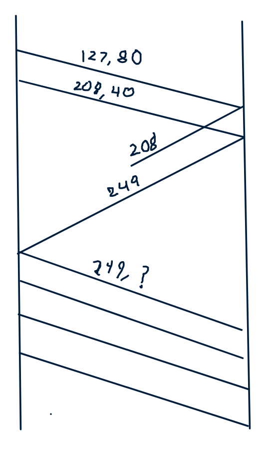

# Exercise Session 12
## Q1 - P30
Can you configure your browser to open multiple simultaneous connections to a Web site? What are the advantages and disadvantages of having a large number of simultaneous TCP connections?

Probably. The advantages are that we can do different things on the same computer using the same program, without the application missing up the data. If was not split up the application would have to split up the data. The disadvantages is that it is way more overhead for the server and the client to have more TCP connections open.

## Q2 - R8
Suppose that a Web server runs in Host C on port 80. Suppose this Web server uses persistent connections, and is currently receiving requests from two different Hosts, A and B. Are all of the request being sent through the same socket at Host C? If they are being passed through different sockets, do both of the sockets have port 80? Discuss and explain.

The server probably has a connection socket and from then on they have different sockets. TCP also uses the IP to differentiate between clients and servers.

## Q3 - R14
### True or false?
-   Host A is sending Host B a large file over a TCP connection. Assume Host B has no data to send Host A. Host B will not send acknowledgements to Host A because Host B cannot piggyback the acknowledgements on data.

    False Host A needs acknowledgements otherwise it does not know if any of the segments have been received.

-   The size of the TCP `rwnd` never changes throughout the duration of the connection.

    True, maybe.

-   Suppose Host A is sending Host B a large file over a TCP connection. The number of unacknowledged bytes that A sends cannot exceed the size of the receive buffer.

    True, as this size of window is passed along in the header.

-   Suppose Host A is sending a large file to Host B over a TCP connection. If the sequence number for a segment of this connection is m, then the sequence number for the subsequent segment will necessarily by m+1

    Only if there is more data in the subsequent segment.

-   The TCP segment has a field in its header for `rwnd`

    False, the sender keeps track of this themselves.

-   Suppose that the last `SampleRTT` in a TCP connection is equal to 1 sec. The current value of `TimeoutInterval` for the connection will necessarily be $\geq 1$ sec.

    True, maybe.

-   Suppose Host A sends one segment with sequence number 38 and 4 bytes of data over a TCP connection to Host B. In this same segment the acknowledgement number is necessarily 42.

    False, it would most likely be 42, but we can not say without more context.

## Q4 - R15
Suppose Host A sends two TCP segments back to back to Host B over a TCP connection. The first segment has sequence number 90; the second has sequence number 110.

-   How much data is in the first segment?

    20 bytes.

-   Suppose that the first segment is lost but the second segment arrives at B. In the acknowledgement that Host B sends to Host A, what will be the acknowledgement number?

    90.

## Q5 - P27
Host A and B are communicating over a TCP connection, and Host B has already received from A all bytes up trough byte 126. Suppose Host A then sends two segments to Host B back-to-back. The first and second segments contain 80 and 40 bytes of data, respectively. In the first segment, the sequence number is 127, the source port number is 302, and the destination port number is 80. Host B sends an acknowledgement whenever it receives a segment from Host A.

-   In the second segment sent from Host A to B, what are the sequence number, source port number and destination port number?

    Sequence number will be 207, source port is 302 and destination port is 80.

-   If the first segment arrives before the second segment, in the acknowledgement of the first arriving segment, what's the acknowledgement number, the source port number, and the destination port number?.

    The acknowledgement number should be 208, source will be 80 and destination will be 302.

-   If the second segment arrives before the first segment, in the acknowledgement of the first arriving segment, what is the acknowledgement number?

    127.

-   Suppose the two segments sent by A arrive in order at B. The first acknowledgement is lost and the second acknowledgement arrives after the first timeout interval. Draw a timing diagram, showing these segments and all other segments and acknowledgements sent. (Assume there is no additional packet loss.) For each segment in your figure, provide the sequence number and the number of bytes of data; for each acknowledgement that you add, provide the acknowledgement number.

## Q6 - P44
Consider sending a large file from a host to another over a TCP connection that has no loss.

-   Suppose TCP uses AIMD for its congestion control without slow start. Assuming `cwnd` increase by 1 MSS every time a batch of ACKs is received and assuming approximately constant round-trip times, how longs does it take for `cwnd` increase from 6 MSS to 12?

    6RTT, that does not feel right.

-   What is the average throughout (in terms of MSS and RTT) for this connection up through $time=6RTT$?

    $\frac{6 + 7 + 8 + 9 + 10 + 11 + 12}{6} = 10.5$
