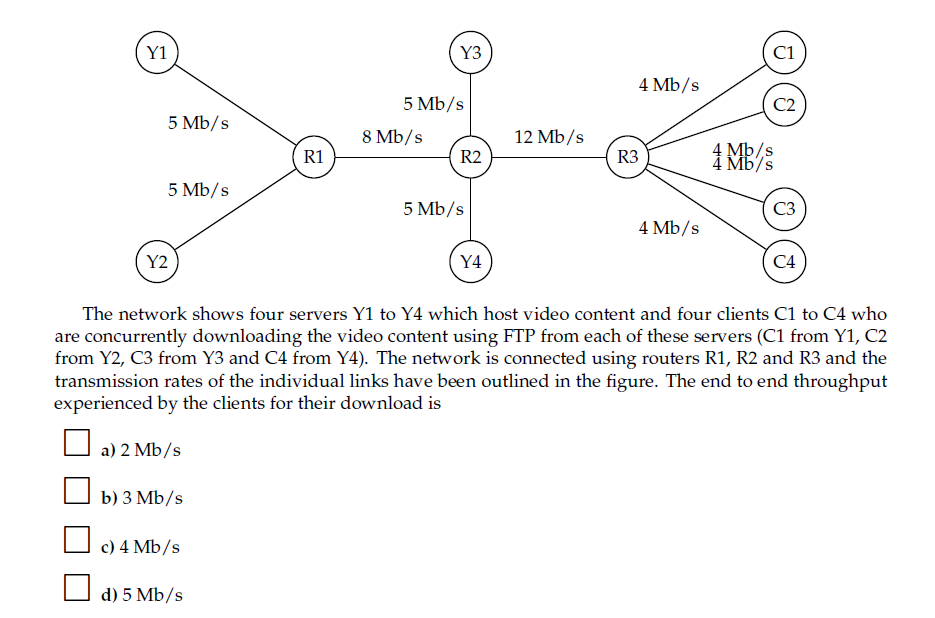

# IWP Exercise Session 9
## Review questions
**R1:** What is the difference between a host and an end system? List several different types of end systems. Is a web server an end system?

There is no difference between a host and an end system they are simply names for the systems that run on the edge of the internet, or the computers that run our applications, and by that definition a web server is also an end system.

**R19:** Suppose Host A wants to send a large file to Host B. The path from Host A to Host B has three links, of rates $R_1=500kbps, R_2=2Mbps, R_3=1Mbps$.

1. Assuming no other traffic in the network, what is the throughput for the file transfer?
2. Suppose the file is 4 million bytes. Dividing the file size by the throughput, roughly how long will it take to transfer the file to host B?
3. Repeat (1) and (2), with $R_2=100kbps$

Answers:

1. $min(R_1, R_2, R_3)=500kbps$
2. $4000000B=31250kb$, thus $\frac{31250kb}{500kbps} \approx 62s$
3. Now the min is $100kbps$, thus we get $\frac{31250kb}{100kbps} \approx 312s$

**R23:** What are the five layers in the Internet protocol stack? What are the principal responsibilities of each of these layers?

- **Application layer:** This is the protocol that the applications use, to communicate with each other, so http smtp etc.
- **Transport layer:** This layer is supposed to transfer a message from one end system to another.
- **Network layer:** This layer transfer segments? from one router to the next
- **Link layer:** This layer is supposed to transfer datagrams from one link to the next so from link-layer switch to router etc.
- **Physical layer:** This layer is responsble for transferring across a single link.

**R24:** What is an application-layer message? A transport-layer segment? A network-layer datagram? A link-layer frame?

The message is something we want to send from one host to another. A segment is a payload message combined with a header. A datagram is a payload together with a header again. And the same for a frame.

## Problems
[Online quiz about transmission and propagation delay](http://gaia.cs.umass.edu/kurose_ross/interactive/end-end-delay.php)

[Online quiz: End te end throughput and bottleneck links](http://gaia.cs.umass.edu/kurose_ross/interactive/end-end-throughput-simple.php)

**P6:** This elementary problem begins to explore propagation delay and transmission delay, two central concepts in data networking. Consider two hosts, A and B, connected by a single link of rate R bps. Suppose that the two hosts are separated by m meters, and suppose the propagation speed along the link is s meters/sec. Host A is to send a packet of size L bits to Host B.

1. Express the propagation delay, $d_{prop}$, in terms of m and s.
2. Determine the transmission time of the paced, $d_{trans}$, in terms of L and R.
3. Ignoring processing and queuing delays, obtain an expression for the end-to-end delay.
4. Suppose Host A begins to transmit the packet at time $t=0$. At time $t=d_{trans}$, where is the last bit of the packet?
5. Suppose $d_{prop}$ is greater than $d_{trans}$ At time $t=d_{trans}$, where is the first bit of the packet?
6. Suppose $d_{prop}$ is less than $d_{trans}$, where is the first of the packet?
7. Suppose $s=2.5 \cdot 10^8$, $L=120b$, and $R=56kbps$. Find the distance $m$ so that $d_{prop} = d_{trans}$.

Answers:

1. The propagation delay is the distance divided by velocity, thus $\frac{m}{s}$.
2. Given the units for L and R the only solution to get time is $\frac{L}{R}$.
3. $\frac{m}{s}+\frac{L}{R}$.
4. It has just been transferred to the link.
5. At the end at the link.
6. Somewhere along the link, but not at the beginning, nor the end.
7. $\frac{m}{2.5 \cdot 10^8}=\frac{120}{56 \cdot 10^3}\Rightarrow m=\frac{120}{56 \cdot 10^3} \cdot 2.5 \cdot 10^8 \approx 5.36 \cdot 10^5$

**Possible exam question:**

The bottleneck should be the link which can handle 12Mb/s. Thus the answer is (b) 3Mb/s.

**P25:** Suppose two hosts, A and B, are separated by 20.000km and are connected by a direct link of $R=2Mbps$. Suppose the propagation speed over the link is $2.5 \cdot 10^8m/s$.

1. Calculate the bandwidth-delay product, $R \cdot d_{prop}$
2. Consider sending a file of 800kb from Host A to Host B. Suppose the file is sent continuously as one large message. What is the maximum number of bits that will be in the link at any given time?
3. Provide an interpretation of the bandwidth-delay product.
4. What is the width (in meters) of a bit in the link? Is it longer than a football field?
5. Derive a general expression for the width of a bit in terms of the propagation speed $s$, the transmission rate $R$, and the length of the link $m$.

Answers:

1. $d_{prop}=\frac{d}{s}=\frac{2 \cdot 10^7}{2.5 \cdot 10^8}=0.08s$. $2 \cdot 10^6 \cdot 0.08=160kb$
2. Should be $160kb$
3. The bandwidth-delay product is the maximum amount of bits that can be in the link at any given time.
4. The length of a bit must be the distance divided by the maximum number of bits in the ling. $\frac{2 \cdot 10^7}{1.6 \cdot 10^5}=125m$
5. $\frac{d}{R \cdot d_{prop}}=\frac{d}{R \cdot \frac{d}{s}}=\frac{s}{R}$

**Question 6:** Et streaming firma skal have uploadet et ny datasæt på 40 terabytes til en server, der er placeret tæt hos forbrugerne, men et stykke væk fra firmaet. Deres Internet forbindelse til serveren tillader en gennemsnitlig upload hastighed på 100 Mbps.   Hvor lang tid tager det? Sammenlig tid og pris med at sende en fysisk pakke med et speditionsfirma med næste-dags levering. Antag firmaet køber en dedikeret forbindelse til serveren, med 10 gange højere kapacitet. Hvor lang tid tager det så? Hvad bliver den gennemsnitlige udnyttelsesgrad af denne, under antagelse af at et nyt datasæt uploades en gang om måneden, og den daglige trafik (email, web-surfing, etc) udgør 20 Mbps i gennemsnit. Overvej de praktiske konsekvenser i scenariet.

First we have that $40TB=320000000Mb$, thus we get that the time it takes is $\frac{320000000}{100}=3200000s \approx 37d$. If they instead get 10 times the capacity it will only take 3.7 days to transfer. So the average use will be $1 \cdot \frac{3.7}{30} + \frac{20}{1000} \cdot \frac{30 - 3.7}{30} \approx 0.14$
