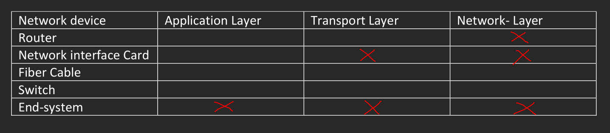
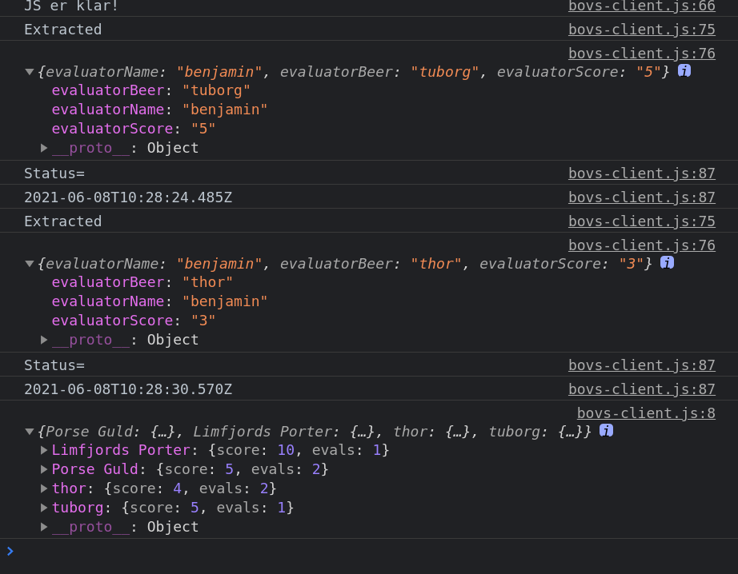

# Student Information
- **Name:** Benjamin Clausen Bennetzen
- **Student number:** 20204861

The exam language on digital exam says Danish, but the exam paper is in English, so i have chosen to also write this in English.

# HTML and HTTP
## 1.1
- **1.1.1:** 3
- **1.1.2:** 3, 4
- **1.1.3:** 3
- **1.1.4:** `<a href="sciencemag.org">good science reading</a>`
- **1.1.5:** Assuming that we get a reply the following is printed.

    Start

    Got Reply

    Finished

## 1.2
1. POST
2. HTTP 1.1
3. scale, device_id, module_id, type, date_begin, ci_cerf_netatmo
4. Cache-Control is set to no-cache which means that the client always has to validate the content with the server, to see if it can reuse the content.
5. Content-Type is application/json, so it sends a json file.

## 1.3
- **1.3.1:** 2, 3, 4, 5 (to be stateless means that it does not use previous requests to process new ones)
- **1.3.2:** 2, 4
- **1.3.3:** 3

## 1.4
We can only say that `continueComputation` returns another promise.

## 1.5
- **1.5.1:** 2, 3, 5

# Computer Networks and the Application Layer
## 2.1
4Mbps

## 2.2


## 2.3
- **2.3.1:** Client 1 -> Local; Local <-> Root; Local <-> TLD; Local <-> Authoritative; Client 1 <- Local
- **2.3.2:** Client 2 <-> Local (due to DNS caching)

## 2.4
3 (we identify a TCP socket with source IP and port and destination IP and port)

4 (TCP will make sure that even if packets are received unordered that they are delivered to the process in order)

# Reliable Data Transfer and the Transport Layer
## 3.1
| Scenario | Sender State | Next sender transition |
| -------- | ------------ | ---------------------- |
| a)       | Wait for call 1 from above | rdt_send(data) |
| b)       | Wait for ack 0 | timeout |
| c)       | Wait for ack 1 | timeout |
| d)       | Wait for ack 1 | timeout |

## 3.2
- **3.3.1:** $N=4861, R=4861, S=5461$
- **3.3.2:** $T=5462, U=5462$
- **3.3.3:** $V=5461$
- **3.3.4:** $W=5462, X=700$
- **3.3.5:** $Y=5462, Z=700$

# Network Security
## 4.1
It feels like there needs more context to say anything concrete

1. Trudy can feign herself as Alice with anyone but she won,t be able to feign herself as Bob to Alice so she cannot be a man-in-the-middle.
2. Trudy can be a man-in-the-middle if the route is insucure
3. Trudy can be a man-in-the-middle
4. TCP in itself is not secure but, we can use other methods like TLS or SSL to have a secure connection while using TCP.

## 4.2
3, 4

# Practical Assignment
## 5.1
There are some newlines in two of the input tags due to length constraints.

```
<!DOCTYPE html>
<html lang="en">
<head>
    <meta charset="utf-8"/>
    <title>IWP BØVS (Basis Øl Vurderings System) </title>
    <link rel="stylesheet" type="text/css" href="css/simple.css">
</head>
<body>

<section>
    <h1 id="id1"> IWP BØVS (Basis Øl Vurderings System)</h1>
    <form id="beerEvalForm_id" action="beerEvaluations" method="post">
        <fieldset>
        <legend>Evaluation form:</legend>
            <div class="myFormLayout">
                <label for="name_id"> Name</label>
                <input type="text" name="name" id="name_id" placeholder="Mickey"
                required minlength="1" maxlength="30">


                <label for="dropdown"> Beer</label>
                <select name="Beer", id="beer">
                    <option value="tuborg">Tuborg</option>
                    <option value="thor">Thor</option>
                    <option value="calsberg">Calsberg</option>
                </select>

                <label for="score"> Score</label>
                <input type="number" name="score" id="score"
                placeholder="1" required min="1" max="10">

                <input type="submit" id="evaluateBtn_id" value="Submit Evaluation">
            </div>
        </fieldset>
    </form>

</section>
<section>
    <button type="button" id="refresh">Refresh</button>
    <table id="highscore">
    </table>
</section>

<script  src="js/bovs-client.js"></script>
</body>
</html>
```

## 5.2
```
function extractBeerEvalData(){
    let beerEvalData = {};

    beerEvalData.evaluatorName = document.getElementById("name_id").value;
    beerEvalData.evaluatorBeer = document.getElementById("beer").value;
    beerEvalData.evaluatorScore = document.getElementById("score").value;

    console.log("Extracted");
    console.log(beerEvalData);

    return beerEvalData;
}
```

## 5.3
```
function validateEvalForm(beerEvaluationFormData){
    let evaluatorNameLen,
        evaluatorName,
        evaluatorBeer,
        evaluatorBeerLen,
        evaluatorScore;

    try {
        evaluatorNameLen = beerEvaluationFormData.evaluatorName.length;
        evaluatorName = beerEvaluationFormData.evaluatorName;
        evaluatorBeer = beerEvaluationFormData.evaluatorBeer;
        evaluatorBeerLen = evaluatorBeer.length;
        evaluatorScore = Number(beerEvaluationFormData.evaluatorScore);
    }
    catch(e) {
        console.log (e);
        throw (new Error(ValidationError));
    }

    if (evaluatorNameLen >= minNameLength && evaluatorNameLen <= maxNameLength &&
        evaluatorScore <= maxScore && evaluatorScore >= minScore &&
        evaluatorBeerLen <= maxBeerLength && evaluatorBeerLen >= minBeerLength) {
        let beerData = {
            evaluatorName: evaluatorName,
            evaluatorBeer: evaluatorBeer,
            evaluatorScore: evaluatorScore
        };
        return beerData;
    } else {
        throw(new Error(ValidationError));
    }
}
```

## 5.4
```
function calcHighscores(DB) {
    let scores = {};
    for (let beer of DB) {
        if (scores.hasOwnProperty(beer.evaluatorBeer)) {
            scores[beer.evaluatorBeer].score += beer.evaluatorScore;
            scores[beer.evaluatorBeer].evals++;
        } else {
            scores[beer.evaluatorBeer] = {
                score: beer.evaluatorScore,
                evals: 1
            }
        }
    };

    Object.keys(scores).forEach( key => {
        scores[key].score = scores[key].score / scores[key].evals;
    });

    return scores;
}
```

## 5.5
Added an extra case to `processReq`

```
case "scores":
    jsonResponse(res, calcHighscores(beerScoresDB));
    break;
```

Now it can be fetched with `jsonFetch("/scores")`.

## 5.6
```
let refresh = document.getElementById("refresh");

refresh.addEventListener("click", () => {
    jsonFetch("/scores").then(res => {
        console.log(res);
        let scoresArr = [];
        Object.keys(res).forEach(key => {
            scoresArr.push([key, res[key].score, res[key].evals]);
        })
        scoresArr.sort((a, b) => -1 * (a[1] - b[1]));

        let table = document.createElement("table");
        table.id = "hightscore"
        let header = `
        <tr>
            <th>Beer</th>
            <th>Score</th>
            <th>Evals</th>
        </tr>`;

        table.innerHTML += header;

        for (let beer of scoresArr) {
            let tr = `
            <tr>
                <th>${beer[0]}</th>
                <th>${beer[1]}</th>
                <th>${beer[2]}</th>
            </tr>`;
            table.innerHTML += tr;
        }

        document.getElementById("highscore").replaceWith(table);
    })
});
```

## 5.7
I did not use the same beer names, so there are still so there are some random ones from the dummy tests, but functionally works fine.


